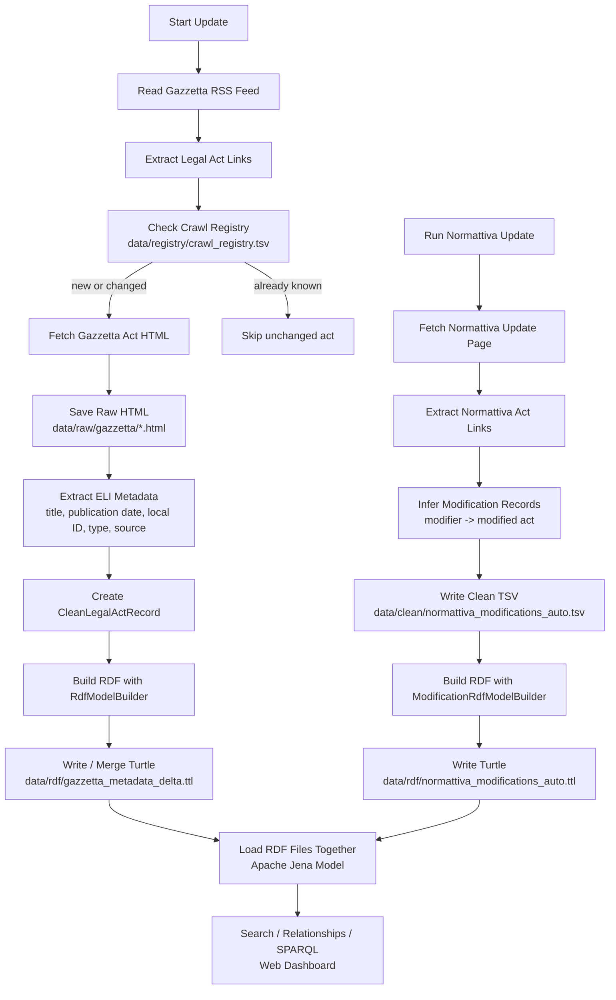

# Crawler Pipeline

This diagram explains how source data becomes RDF.



Short explanation:

```text
The crawler does not store data in a heavy database.
It saves raw source files, extracts clean legal metadata, and writes simple RDF Turtle files.
The backend later loads those Turtle files into Jena for search and SPARQL.
```
