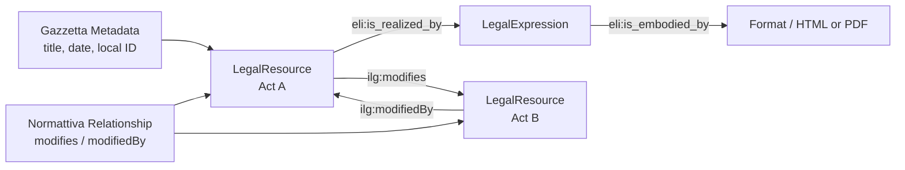

# Knowledge Graph / Data Model

This diagram shows the main RDF classes and relationships used by the project.

```mermaid
classDiagram
    class LegalResource {
        rdf:type eli:LegalResource
        rdfs:label title
        eli:title title
        eli:id_local localId
        eli:date_publication publicationDate
        eli:date_document documentDate
        eli:type_document documentType
        dcterms:source sourceUrl
    }

    class LegalExpression {
        rdf:type eli:LegalExpression
        rdfs:label title
        eli:title title
        eli:language language
        eli:publisher publisher
    }

    class Format {
        rdf:type eli:Format
        eli:format fileFormat
        schema:contentUrl pdfUrl
    }

    class PublicationMetadata {
        source Gazzetta
        title
        publicationDate
        localId
        sourceUrl
    }

    class Modification {
        source Normattiva
        ilg:modifies
        ilg:modifiedBy
        eli:commences
        eli:commenced_by
    }

    LegalResource --> LegalExpression : eli:is_realized_by
    LegalExpression --> LegalResource : eli:realizes
    LegalExpression --> Format : eli:is_embodied_by

    PublicationMetadata --> LegalResource : describes
    Modification --> LegalResource : subject act
    Modification --> LegalResource : object act

    LegalResource --> LegalResource : ilg:modifies
    LegalResource --> LegalResource : ilg:modifiedBy
    LegalResource --> LegalResource : eli:commences
    LegalResource --> LegalResource : eli:commenced_by
```

Same model as RDF triples:



Short explanation:

```text
LegalResource is the main legal act node.
Gazzetta metadata adds title, date, local ID, type, and source.
Normattiva data adds relationships between legal acts.
The final graph connects acts using RDF predicates such as modifies and modifiedBy.
```
