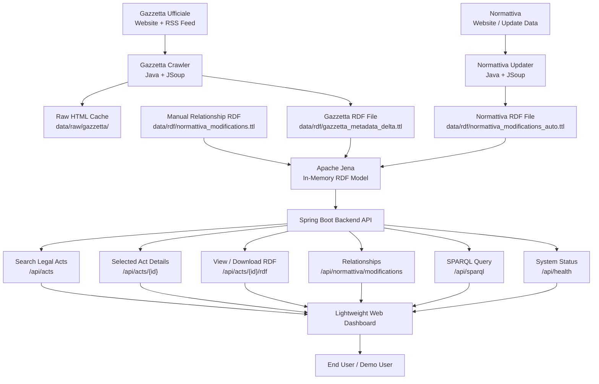

# Overall System Architecture

This diagram shows the full lightweight architecture of the project.



Short explanation:

```text
Gazzetta provides publication metadata.
Normattiva provides legal relationship data.
Both are converted into RDF Turtle files.
Apache Jena loads the files together in memory.
Spring Boot exposes the data to a simple dashboard.
```
